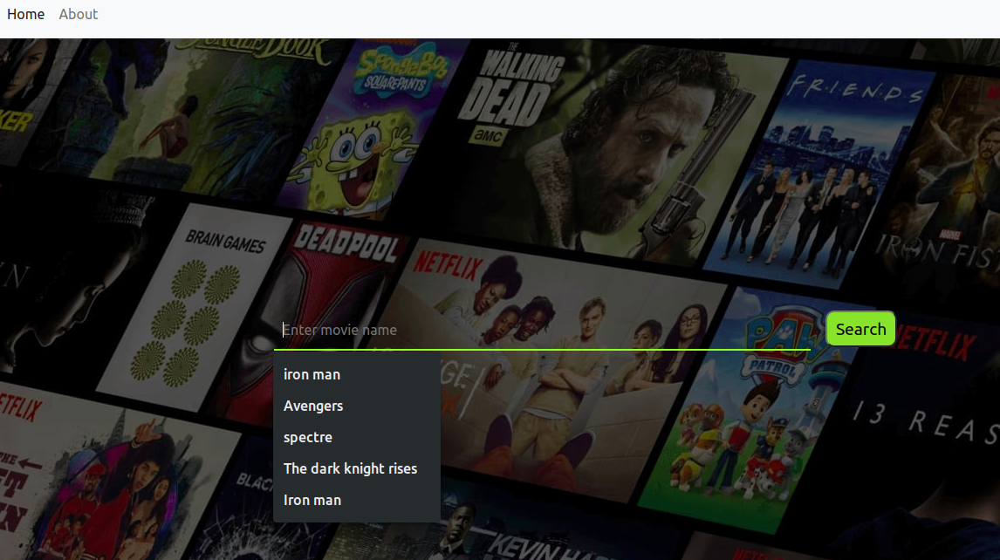

# Recommendation-Engine

Movie Recommendation Engine - Content Based and Collaborative Filtering. Has a collection movies updated till 2020.

# Collaborative Filtering #

A type of movie recommendation in which the user's interests are considered and suggests movie by finding similar users. Similar users are identified by cosine similarity. This type of recommendation requires large database that stores users details, watched movies etc. The accuracy of this method completely lies on user's true/unbiased ratings.

 

# Content Filtering #

A type of movie recommendation in which the details of the movies are considered and suggests movies similar to the user-liked-movie. The accuracy of this suggestion depends on the features that are considered. In this project the features that are take are as follows:

- Director Name
- Actor 1
- Actor 2
- Actor 3
- Genre
- Keywords

# Folder Description #
1. Collaborative_Filtering
    - Collab_Filtering.ipynb
    - movies.csv
    - ratings.csv
 
2. Content_Filtering
    - flask : For front end final application
    - movie_metadata.csv
    - d_2016.csv, d_2017.csv, d_2018.csv, d_2019.csv, d_2020.csv : d_<yyyy> Contains movies data till year 'yyyy'.
    - final2.csv : Added keywords for all movies using API
    - recommend.csv : Created possible top 20 movies for each movie in the dataset.
    - Data_Cleaning.ipynb : Cleaning data and feature extraction
    - Keyword_feature.ipynb : Extracting keywords for all movies
    - Recommend.ipynb : Created possible top 20 movies for each movie in the dataset.
    - Poster_path.ipynb : Extracted links for poster for each movie in the dataset using API.
  
# Links #

[IMDB 5000 Movie dataset](https://www.kaggle.com/carolzhangdc/imdb-5000-movie-dataset)

[Movie datset for(esp for 2017)](https://www.kaggle.com/rounakbanik/the-movies-dataset)

[Movies for 2018](https://en.wikipedia.org/wiki/List_of_American_films_of_2018)

[Movies for 2019](https://en.wikipedia.org/wiki/List_of_American_films_of_2019)

[Movies for 2020](https://en.wikipedia.org/wiki/List_of_American_films_of_2020)
